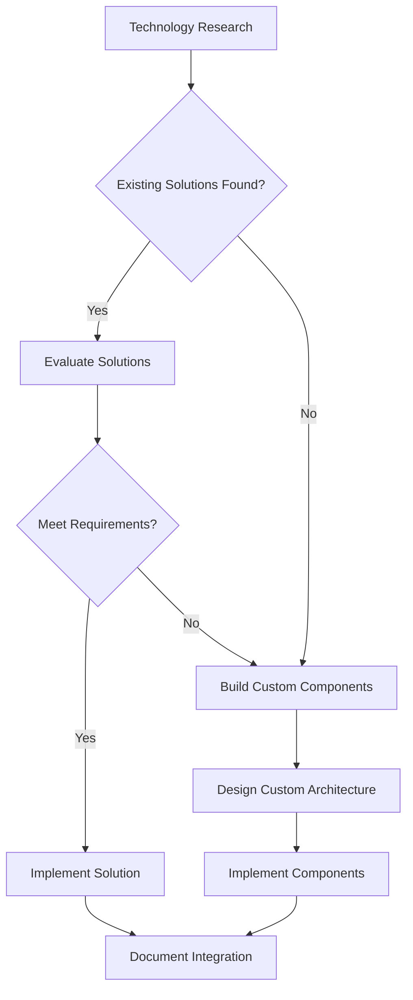

# PowerPoint Generation POC - Project Plan

## Project Overview
**Project Name:** PPTX Generation with Local AI
**Status:** Planning Phase (Sprint 0)
**Objective:** Create a minimal viable POC demonstrating that local AI models (Ollama) can generate PowerPoint presentations through a simple web interface using natural language input.

## Sprint 0: Project Initiation

### 1. Project Initiation Document (PID)

#### Project Goals
- **Primary Goal:** Demonstrate feasibility of using local AI models to generate PowerPoint presentations
- **Secondary Goals:**
  - Create simple web interface for user input
  - Establish API communication between frontend and Ollama backend
  - Generate basic 3-slide PowerPoint presentations
  - Implement Docker-based microservices architecture
  - Validate the KISS (Keep It Simple, Stupid) approach

#### Success Criteria
- ✅ User can input natural language description via web interface
- ✅ Backend processes input and generates structured presentation content
- ✅ System produces downloadable PPTX file with 3 slides
- ✅ All components run in Docker containers
- ✅ Basic presentation formatting is professional and functional

#### Out of Scope (Future Sprint Considerations)
- Advanced slide templates and styling
- Image integration and processing
- Complex presentation structures (>3 slides)
- User authentication and session management
- Advanced AI model fine-tuning
- Multi-language support
- Collaboration features

### 2. Requirements Analysis

#### Functional Requirements
| ID | Requirement | Priority |
|----|------------|----------|
| FR-001 | Web interface for user input | High |
| FR-002 | API endpoint for processing user input | High |
| FR-003 | Ollama backend integration | High |
| FR-004 | Basic presentation structure generation (3 slides) | High |
| FR-005 | PPTX file generation | High |
| FR-006 | Download functionality | High |
| FR-007 | Docker containerization for all components | High |
| FR-008 | Basic error handling and user feedback | Medium |

#### Non-Functional Requirements
| ID | Requirement | Priority |
|----|------------|----------|
| NFR-001 | System should respond within 30 seconds | Medium |
| NFR-002 | Docker containers should be lightweight | Medium |
| NFR-003 | Code should follow basic clean code principles | High |
| NFR-004 | Minimal dependencies for easy setup | High |

### 3. User Stories and Use Cases

#### User Stories
1. **As a** user, **I want to** input a presentation topic in natural language, **so that** I can generate a basic PowerPoint presentation quickly.
2. **As a** user, **I want to** see a preview of my generated presentation, **so that** I can verify it meets my needs before downloading.
3. **As a** user, **I want to** download the generated presentation as a PPTX file, **so that** I can use it in PowerPoint or LibreOffice.
4. **As a** developer, **I want** clear separation between frontend and backend components, **so that** I can maintain and scale the system easily.

#### Use Case: Generate Presentation
**Primary Actor:** User
**Preconditions:** System is running and accessible via web browser
**Main Flow:**
1. User navigates to web interface
2. User enters presentation topic/description in natural language
3. User clicks "Generate" button
4. System processes input through Ollama backend
5. System generates 3-slide presentation structure
6. System creates PPTX file
7. System displays preview to user
8. User downloads PPTX file

**Alternative Flows:**
- Error handling for invalid input
- Timeout handling for long processing
- Fallback for AI model unavailability

## Sprint 1: Implementation Plan

### 1. Conceptual Design

#### System Architecture Overview


#### Component Responsibilities
- **Frontend Web App:** User interface, input collection, preview display, download functionality
- **Orchestrator Service:** API endpoint, request routing, response processing, error handling
- **Ollama Backend:** Natural language processing, content generation, structure suggestion
- **PPTX Generator:** Template processing, slide creation, file formatting

### 2. Technical Design

#### Technology Stack
- **Frontend:** HTML/CSS/JavaScript (simple, no framework for MVP)
- **Backend:** Node.js/Express or Python Flask (lightweight)
- **AI Backend:** Ollama with ministral-3-14b-it-2512 (Q8 quantized)
- **Containerization:** Docker for all components
- **PPTX Generation:** Python-pptx library or similar

#### Docker Architecture


#### Data Flow
1. User input → Frontend → Orchestrator API
2. Orchestrator → Ollama (prompt processing)
3. Ollama response → Orchestrator → PPTX Generator
4. Generated PPTX → Orchestrator → Frontend → User

### 3. Implementation Roadmap

#### Phase 1: Core Functionality (Priority: High)
1. **Frontend Development**
   - Simple HTML form for user input
   - Basic CSS styling
   - JavaScript for API communication
   - Download button functionality

2. **Orchestrator Service**
   - REST API endpoint (/generate)
   - Request validation
   - Ollama integration
   - Response processing
   - Error handling middleware

3. **Ollama Integration**
   - Model selection (ministral-3-14b-it-2512 for optimal performance)
   - Prompt engineering for presentation structure
   - Response parsing and formatting

4. **PPTX Generator**
   - Basic 3-slide template (Title, Content, Summary)
   - Python-pptx implementation
   - File generation and storage
   - File serving endpoint

#### Phase 2: Docker Implementation (Priority: High)
1. **Containerize Frontend**
   - Nginx or simple Node.js server
   - Multi-stage build for optimization
   - Environment variables for configuration

2. **Containerize Orchestrator**
   - Lightweight base image
   - Port configuration
   - Health checks

3. **Ollama Container**
   - Official Ollama image
   - Model pre-loading
   - Volume for model storage

4. **PPTX Generator Container**
   - Python base image
   - Dependency installation
   - Shared volume for file generation

5. **Docker Compose**
   - Network configuration
   - Service dependencies
   - Volume management
   - Port mapping

#### Phase 3: Integration and Testing (Priority: Medium)
1. **End-to-end testing**
2. **Error scenario testing**
3. **Performance benchmarking**
4. **User acceptance testing**

### 4. Execution Order

| Order | Task | Component | Estimated Effort |
|-------|------|-----------|------------------|
| 1 | Create basic frontend interface | Frontend | Low |
| 2 | Set up orchestrator API skeleton | Orchestrator | Low |
| 3 | Implement Ollama integration | Orchestrator | Medium |
| 4 | Create basic PPTX generator | PPTX Generator | Medium |
| 5 | Implement frontend-backend communication | Frontend/Orchestrator | Low |
| 6 | Create Dockerfile for frontend | Frontend | Low |
| 7 | Create Dockerfile for orchestrator | Orchestrator | Low |
| 8 | Configure Ollama Docker container | Ollama | Low |
| 9 | Create Dockerfile for PPTX generator | PPTX Generator | Low |
| 10 | Implement docker-compose.yml | Infrastructure | Medium |
| 11 | Basic integration testing | All | Medium |
| 12 | Error handling implementation | All | Medium |

## Technical Considerations

### API Contracts (Sprint 1 Implementation)

#### Orchestrator API
```
POST /api/v1/generate
Content-Type: application/json

Request:
{
  "topic": "string",           // Required: presentation topic
  "language": "en"             // Optional: defaults to "en"
}

Response (200 OK):
{
  "success": true,
  "fileId": "uuid",
  "downloadUrl": "/api/v1/download/{fileId}",
  "preview": { ... }           // Slide content for preview
}

Error Response (4xx/5xx):
{
  "success": false,
  "error": {
    "code": "VALIDATION_ERROR|LLM_ERROR|GENERATION_ERROR",
    "message": "Human readable message"
  }
}
```

#### Expected Ollama Response Format
The LLM prompt should instruct Ollama to return JSON:
```json
{
  "title": "Presentation Title",
  "slides": [
    {
      "type": "title",
      "heading": "Main Title",
      "subheading": "Optional subtitle"
    },
    {
      "type": "content",
      "heading": "Key Points",
      "bullets": ["Point 1", "Point 2", "Point 3"]
    },
    {
      "type": "summary",
      "heading": "Summary",
      "bullets": ["Takeaway 1", "Takeaway 2"]
    }
  ]
}
```

#### Health Check Endpoints
All services expose: `GET /health` returning `{"status": "ok"}`

### AI Model Selection
- **Primary Model:** ministral-3-14b-it-2512 (Q8 quantized version)
- **Resource-Optimized Alternative:** ministral-3-8b-it-2512 (Q8 quantized version)
- **Model Characteristics:** State-of-the-art as of December 2025, optimized for instruction following and content generation
- **Prompt Engineering:** Focus on clear structure generation (title, main points, summary)

### Technology Research Task (Pre-Implementation)

**Objective:** Research and evaluate existing Docker-based solutions for frontend and orchestrator components before making build vs. buy decisions.

#### Research Prompt for AI Assistant

**Task:** Evaluate existing Docker-based microservices solutions for our PowerPoint Generation POC project.

**Requirements:**
1. **Frontend Component:**
   - Simple web interface for user input
   - Ability to display presentation previews
   - Download functionality for PPTX files
   - Docker container ready
   - Minimal setup complexity

2. **Orchestrator Component:**
   - API endpoint for processing user requests
   - Integration with Ollama backend
   - Request routing and response processing
   - Error handling capabilities
   - Docker container ready
   - Potential integration with frameworks like LangChain or similar orchestration tools

3. **Technical Constraints:**
   - Must work with ministral-3-14b-it-2512 model
   - Docker microservices architecture
   - Simple and maintainable codebase
   - Open source preferred
   - Active community support

**Evaluation Criteria:**
- Ease of Docker implementation
- Compatibility with our architecture
- Performance characteristics
- Community adoption and support
- Learning curve for our team
- Long-term maintainability

**Potential Solutions to Research:**
- **Frontend:** Simple Nginx-based solutions, lightweight Node.js frameworks, or existing web UI templates
- **Orchestrator:** FastAPI, Express.js, or specialized AI orchestration frameworks
- **Integration:** LangChain, LlamaIndex, or custom solutions
- **Existing Projects:** Any open-source projects that combine web UI with LLM backend

**Deliverable:** Recommendation report with pros/cons of top 3 options for each component, including implementation complexity estimates.

#### Research Questions to Answer

1. What existing Docker-based frontend solutions could handle our simple UI requirements?
2. Are there lightweight orchestrator services that integrate well with Ollama?
3. Should we consider frameworks like LangChain for the orchestrator, or build custom?
4. What are the trade-offs between using existing solutions vs. building our own?
5. Are there any existing projects that combine similar functionality we could learn from?

#### Implementation Decision Tree



## Updated Implementation Roadmap

### Phase 0: Technology Research (New - High Priority)
1. **Research existing solutions** - 2-3 days
2. **Evaluate options** - 1 day
3. **Make build vs. buy decisions** - 1 day
4. **Update architecture based on findings** - 1 day

### Phase 1: Core Components (Updated)
1. **Frontend Development** - Implementation based on research findings
2. **Orchestrator Service** - Implementation based on research findings
3. **Ollama Integration** - Using ministral-3-14b-it-2512
4. **PPTX Generator** - Basic 3-slide template implementation
5. **Docker Implementation** - Containerize all components

### Phase 2: Integration & Testing
1. **End-to-end workflow validation**
2. **Error handling and edge cases**
3. **Performance optimization**
4. **User acceptance testing**

### Expected Deliverables (Updated)
- ✅ Technology research report with recommendations
- ✅ Working web interface for presentation generation
- ✅ Functional API communication with Ollama backend
- ✅ Professional 3-slide PowerPoint output
- ✅ Downloadable PPTX files
- ✅ Dockerized microservices architecture

### PPTX Generation Approach
- **Library:** python-pptx (Python) or pptxgenjs (JavaScript)
- **Template Strategy:** Start with hardcoded 3-slide structure
- **Future Expansion:** Template files for different presentation types

### Performance Optimization
- **Caching:** Consider caching frequent presentation topics
- **Streaming:** Implement response streaming for better UX
- **Resource Management:** Monitor Ollama memory usage

## Risk Assessment

| Risk | Impact | Mitigation Strategy |
|------|--------|---------------------|
| Ollama model performance | High | Test with different models, implement fallbacks |
| PPTX generation complexity | Medium | Start with simplest possible implementation |
| Docker networking issues | Medium | Thorough testing of container communication |
| User input variability | High | Implement input validation and guidance |
| Processing timeouts | Medium | Implement progress indicators and timeouts |

## Next Steps

1. ✅ Complete Sprint 0 documentation (this document)
2. Create detailed technical specifications for each component
3. Set up development environment with Docker
4. Begin implementation with highest priority items
5. Regular testing and validation at each stage

## Future Sprint Ideas

**Sprint 2: Enhanced Functionality**
- Advanced slide templates and styling options
- Image generation and integration
- Multi-slide presentations (5-10 slides)
- Presentation theme selection

**Sprint 3: User Experience**
- Interactive preview with editing capabilities
- Presentation history and favorites
- User accounts and saved preferences
- Export options (PDF, images)

**Sprint 4: Advanced Features**
- Collaborative editing
- Voice input for presentation description
- Multi-language support
- Advanced AI customization options