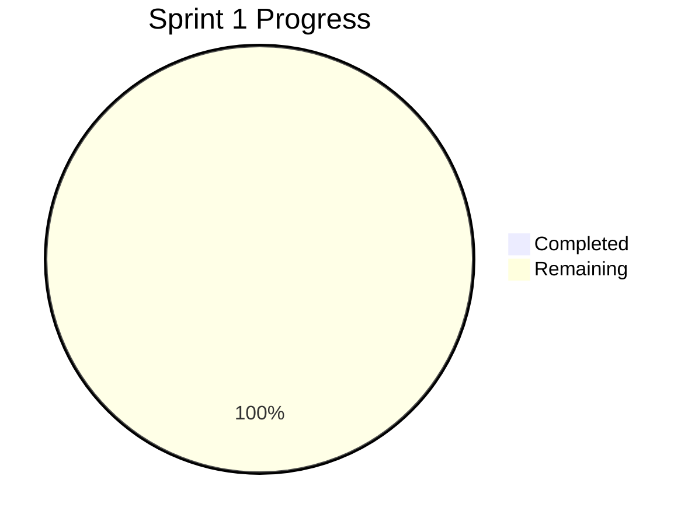

# Sprint 1 Daily Progress Log

> **Task tracking:** See [IMPLEMENTATION_CHECKLIST.md](IMPLEMENTATION_CHECKLIST.md) for the full task list
> **Sprint overview:** See [SPRINT1_PLAN.md](SPRINT1_PLAN.md) for goals and phases

---

## Current Sprint Status

**Sprint Start:** 2025-12-04
**Overall Progress:** 0%

### Phase Progress
| Phase | Status | Progress |
|-------|--------|----------|
| Planning | Complete | 100% |
| Frontend | Not Started | 0% |
| Backend | Not Started | 0% |
| PPTX Generator | Not Started | 0% |
| Docker | Not Started | 0% |
| Testing | Not Started | 0% |

### Progress Visualization



---

## Daily Log Entries

### [YYYY-MM-DD] - Day X

**Status:** Green / Yellow / Red
**Focus:** [Main objective for today]

#### Tasks Completed
- [ ] Task 1 - [Time spent]
- [ ] Task 2 - [Time spent]

#### Tasks Planned for Tomorrow
- [ ] Task 1
- [ ] Task 2

#### Blockers
- None / [Description + Resolution plan]

#### Learnings
- [Key insight or discovery]

#### Metrics
| Metric | Value |
|--------|-------|
| Time spent | X hours |
| Tasks completed | X |
| Lines of code | X |

---

## Weekly Summary Template

### Week X (YYYY-MM-DD to YYYY-MM-DD)

**Status:** Green / Yellow / Red
**Progress:** X% complete

#### Accomplishments
- Major accomplishment 1
- Major accomplishment 2

#### In Progress
- Task in progress 1
- Task in progress 2

#### Blocked
- None / [Blocker + owner]

#### Next Week Focus
- Priority 1
- Priority 2

---

## Standup Notes Template

### [YYYY-MM-DD] Standup

**Yesterday:**
- Completed X
- Completed Y

**Today:**
- Working on X
- Working on Y

**Blockers:**
- None / [Description]

---

## Sprint Metrics

### Quality Targets
| Metric | Target | Current | Status |
|--------|--------|---------|--------|
| Response time | < 30s | - | - |
| Docker image size | < 200MB | - | - |
| Test pass rate | 90% | - | - |

### Delivery Metrics
| Metric | Target | Current |
|--------|--------|---------|
| Tasks completed | 90 | 0 |
| Sprint completion | 100% | 0% |

---

## Retrospective Preparation

### Questions to Answer at Sprint End
1. What went well?
2. What could have gone better?
3. What should we start doing?
4. What should we stop doing?
5. What should we continue doing?
6. What were the biggest challenges?
7. What did we learn?

### Action Items
- [ ] Action 1 - [Owner]
- [ ] Action 2 - [Owner]

---

## Daily Routines

### Morning
- [ ] Review yesterday's progress
- [ ] Check [IMPLEMENTATION_CHECKLIST.md](IMPLEMENTATION_CHECKLIST.md) for next task
- [ ] Plan today's work
- [ ] Update this log

### Evening
- [ ] Update task completion in checklist
- [ ] Log time spent
- [ ] Document learnings
- [ ] Plan for tomorrow

---

## Notes

### Technical Decisions
| Decision | Date | Rationale |
|----------|------|-----------|
| - | - | - |

### Lessons Learned
| Lesson | Date | Impact |
|--------|------|--------|
| - | - | - |

### Useful Commands
```bash
# Build and run containers
docker-compose build
docker-compose up -d

# Check container status
docker-compose ps

# View logs
docker-compose logs -f

# Clean up
docker-compose down -v
```

---

## Quick Status

**Traffic Light:** Green / Yellow / Red

```
Overall:  [          ] 0%
Frontend: [          ] 0%
Backend:  [          ] 0%
PPTX:     [          ] 0%
Docker:   [          ] 0%
```
