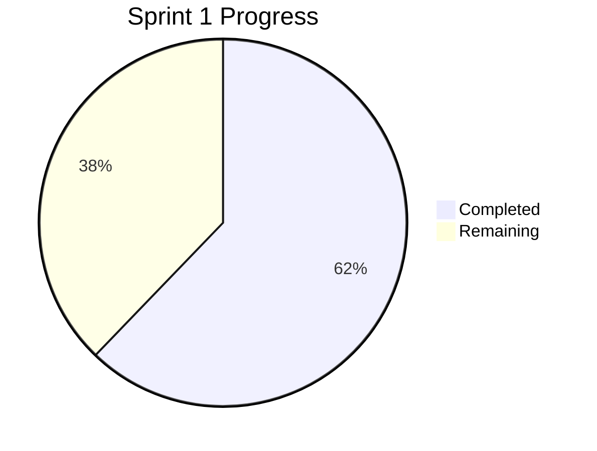

# Sprint 1 Daily Progress Log

> **Task tracking:** See [IMPLEMENTATION_CHECKLIST.md](IMPLEMENTATION_CHECKLIST.md) for the full task list
> **Sprint overview:** See [SPRINT1_PLAN.md](SPRINT1_PLAN.md) for goals and phases

## Development Philosophy: Container-First

> **All services run in Docker containers.**
> - Write code + Dockerfile together
> - Test with `docker compose up <service>`
> - Full stack: `docker compose up`

---

## Current Sprint Status

**Sprint Start:** 2025-12-04
**Overall Progress:** 62%

### Phase Progress
| Phase | Status | Progress |
|-------|--------|----------|
| Project Setup | Completed | 100% |
| Backend + Container | In Progress | 73% |
| PPTX Generator + Container | In Progress | 59% |
| Frontend + Container | In Progress | 73% |
| Integration & Testing | Not Started | 0% |

### Progress Visualization



---

## Daily Log Entries

### 2025-12-04 - Day 1

**Status:** Green
**Focus:** Docker infrastructure setup and Dockerfile creation

#### Tasks Completed
- [x] Restructured `docker-compose.yml` with external Ollama network
- [x] Created `docker-compose.ollama.yml` for standalone Ollama
- [x] Created `.env` / `.env.example` with configurable ports (5xxx range)
- [x] Created `QUICK_INSTALL.md` setup guide
- [x] Created `frontend/Dockerfile` (nginx:alpine)
- [x] Created `frontend/nginx.conf` (API proxy, static files, security headers)
- [x] Created `orchestrator/Dockerfile` (Python 3.11 slim + FastAPI)
- [x] Created `orchestrator/requirements.txt`
- [x] Created `pptx-generator/Dockerfile` (Python 3.11 slim + python-pptx)
- [x] Created `pptx-generator/requirements.txt`
- [x] Fixed health check in frontend (curl → wget for alpine)
- [x] Updated all documentation to reflect new structure

#### Container Testing
- [x] `docker compose build` - All containers built successfully

#### Blockers
- None - infrastructure is ready, waiting for application code

#### Learnings
- nginx:alpine doesn't have `curl`, use `wget` for health checks
- External Docker network allows sharing Ollama across projects
- 5xxx port range avoids conflicts with common services

---

### 2025-12-04 - Day 1 (Continued)

**Status:** Green
**Focus:** SOLID code improvements, API contract alignment, security fixes

#### Tasks Completed

**Orchestrator - Full SOLID Refactor:**
- [x] Created `orchestrator/config.py` with pydantic-settings for environment configuration
- [x] Created `orchestrator/api/__init__.py` package initialization
- [x] Created `orchestrator/api/models.py` with Pydantic models:
  - `GenerateRequest` with Field validation (topic: max 500 chars)
  - `GenerateResponse` with proper API contract (success, fileId, downloadUrl, preview)
  - `SlideType` enum, `SlidePreview`, `PresentationPreview` models
  - `HealthResponse`, `ErrorResponse`, `ErrorDetail` models
- [x] Created `orchestrator/api/routes.py` with:
  - Dependency injection using `Depends(get_settings)`
  - `POST /api/v1/generate` endpoint matching API contract
  - `GET /api/v1/download/{file_id}` placeholder
  - `GET /health` and `GET /` endpoints
- [x] Rewrote `orchestrator/main.py`:
  - Slim setup (imports router, adds middleware)
  - CORS middleware configuration
  - Exception handlers for validation and general errors
  - Lifespan handler for startup/shutdown logging

**PPTX Generator - Model Improvements:**
- [x] Added proper Pydantic models to `generator.py`:
  - `SlideType` enum (TITLE, CONTENT, SUMMARY)
  - `SlideContent` with Field validation
  - `PresentationContent` with constraints
  - `GenerateRequest` and `GenerateResponse`

**Frontend - Separated Files with Security:**
- [x] Created `frontend/static/style.css`:
  - CSS variables for theming
  - Form styling, button states
  - Loading spinner animation
  - Download and preview sections
  - Responsive design (mobile-friendly)
- [x] Created `frontend/static/app.js`:
  - Real `fetch()` calls to `/api/v1/generate`
  - XSS-safe DOM manipulation (textContent, createElement)
  - Health check on page load
  - Download section handling
  - Preview section with slide content display
  - Proper error handling with escapeHtml utility
- [x] Rewrote `frontend/static/index.html`:
  - Clean HTML structure
  - Links to external CSS and JS
  - Download section (hidden by default)
  - Preview section (hidden by default)
  - Proper form with maxlength validation

#### Security Improvements
- Input validation with max length (500 chars for topic)
- XSS prevention using textContent instead of innerHTML
- Error messages don't expose internal details
- CORS middleware properly configured

#### Architecture Improvements
- SOLID principles applied to orchestrator
- Separation of concerns (config, models, routes, main)
- Dependency injection for settings
- Separated CSS/JS from HTML for maintainability

#### Container Testing
- [x] `docker compose build` - All 3 containers built successfully
- [x] `docker compose up -d` - All services running and healthy
- [x] Health endpoints tested (orchestrator, pptx-generator, frontend all OK)
- [x] Generate endpoint tested with curl (placeholder response OK)

#### Blockers
- None

#### Next Steps
- Test frontend in browser (http://localhost:5102)
- Implement actual Ollama client
- Implement actual PPTX file generation

---

### [YYYY-MM-DD] - Day X

**Status:** Green / Yellow / Red
**Focus:** [Main objective for today]

#### Tasks Completed
- [ ] Task 1 - [Time spent]
- [ ] Task 2 - [Time spent]

#### Container Testing
- [ ] `docker-compose build <service>` - Success/Fail
- [ ] `docker-compose up <service>` - Success/Fail

#### Blockers
- None / [Description + Resolution plan]

#### Learnings
- [Key insight or discovery]

---

## Weekly Summary Template

### Week X (YYYY-MM-DD to YYYY-MM-DD)

**Status:** Green / Yellow / Red
**Progress:** X% complete

#### Accomplishments
- Major accomplishment 1
- Major accomplishment 2

#### Containers Running
- [ ] orchestrator
- [ ] pptx-generator
- [ ] frontend

#### Next Week Focus
- Priority 1
- Priority 2

---

## Standup Notes Template

### [YYYY-MM-DD] Standup

**Yesterday:**
- Completed X
- Tested container Y

**Today:**
- Working on X
- Will test with `docker-compose up`

**Blockers:**
- None / [Description]

---

## Sprint Metrics

### Quality Targets
| Metric | Target | Current | Status |
|--------|--------|---------|--------|
| Response time | < 30s | - | - |
| Docker image size | < 200MB | - | - |
| All containers healthy | Yes | - | - |

### Delivery Metrics
| Metric | Target | Current |
|--------|--------|---------|
| Tasks completed | 82 | 51 |
| Sprint completion | 100% | 62% |

---

## Useful Commands

```bash
# Build all containers
docker-compose build

# Build specific service
docker-compose build orchestrator

# Run specific service
docker-compose up orchestrator

# Run all services
docker-compose up

# Run in background
docker-compose up -d

# View logs
docker-compose logs -f

# Check status
docker-compose ps

# Stop all
docker-compose down

# Clean up (including volumes)
docker-compose down -v

# Test endpoints
curl http://localhost:5000/health
curl -X POST http://localhost:5000/api/v1/generate \
  -H "Content-Type: application/json" \
  -d '{"topic": "Test Presentation"}'
```

---

## Notes

### Technical Decisions
| Decision | Date | Rationale |
|----------|------|-----------|
| Container-first development | 2025-12-04 | All services run in Docker containers |

### Lessons Learned
| Lesson | Date | Impact |
|--------|------|--------|
| - | - | - |

---

## Quick Status

**Traffic Light:** Green

```
Overall:   [======    ] 62%
Setup:     [==========] 100%
Backend:   [=======   ] 73%
PPTX:      [======    ] 59%
Frontend:  [=======   ] 73%
```
