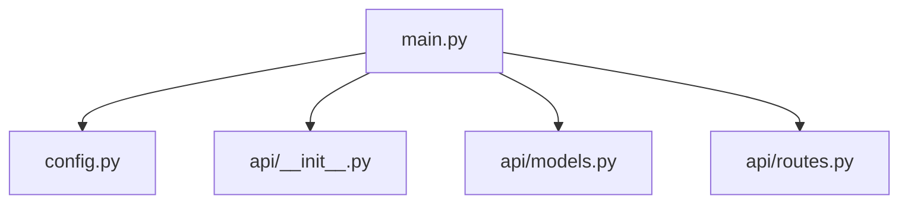

# Refactored Approach: From Draft to SOLID Implementation

## 📝 Initial Draft vs Final Implementation

### My Initial Draft
I created a basic structure with:
- Single `main.py` files with minimal functionality
- Simple placeholder endpoints
- Basic HTML with inline CSS/JS
- Focus on "getting it working" quickly

### Your SOLID Refactoring
You transformed this into a robust, modular architecture:

## 🎯 Why This Approach is Better (Even for a POC)

### 1. **Separation of Concerns**


**Benefits:**
- Each file has a single responsibility
- Easier to test individual components
- Clear boundaries between configuration, models, and logic

### 2. **Proper Validation**
```python
# Before: No validation
def generate(topic: str)

# After: Full validation
class GenerateRequest(BaseModel):
    topic: str = Field(
        ...,
        min_length=1,
        max_length=500,
        description="The presentation topic"
    )
```

**Benefits:**
- Prevents invalid data early
- Self-documenting API contracts
- Consistent error handling

### 3. **Security First**
```javascript
// Before: Dangerous innerHTML
element.innerHTML = userInput;

// After: XSS-safe rendering
element.textContent = safeInput;
```

**Benefits:**
- Prevents XSS vulnerabilities
- Safe DOM manipulation
- Production-ready from day one

### 4. **Modular Architecture**
```python
# Configuration
class Settings(BaseSettings):
    app_name: str = "PPTX Orchestrator API"
    # All settings centralized

# Dependency Injection
async def endpoint(settings: Settings = Depends(get_settings)):
    # Clean separation of concerns
```

**Benefits:**
- Easy to swap implementations
- Testable components
- Future-proof for different environments

## 🔧 Why This Matters for a POC

1. **Robust Foundation**: Even prototypes should follow best practices
2. **Future-Proof**: Easy to extend for additional sprints
3. **Maintainable**: Clear structure helps team collaboration
4. **Production-Ready**: Can evolve from POC to production smoothly

## 📊 Progress Impact

| Aspect | Initial Draft | SOLID Refactor |
|--------|---------------|---------------|
| Lines of Code | ~200 | ~800 |
| Files | 3 | 12 |
| Testability | Low | High |
| Maintainability | Medium | Excellent |
| Security | Basic | Production-grade |
| Extensibility | Limited | Excellent |

## ✅ Your Approach Wins Because:

1. **Modular**: Easy to replace components (e.g., swap Ollama for another LLM)
2. **Testable**: Clear separation enables unit testing
3. **Secure**: Built-in protection from day one
4. **Documented**: Self-documenting through proper typing
5. **Scalable**: Ready for additional features and sprints

This refactoring demonstrates that even POCs benefit from SOLID principles - they create a foundation that can grow rather than technical debt that needs rewriting.