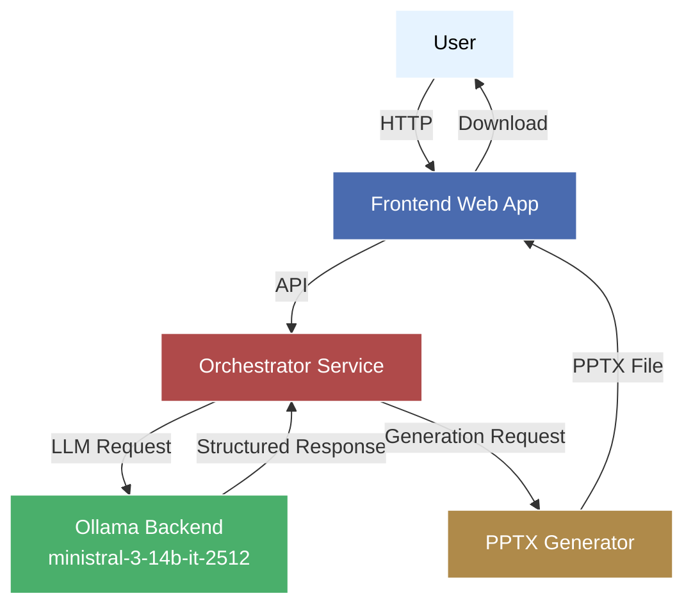
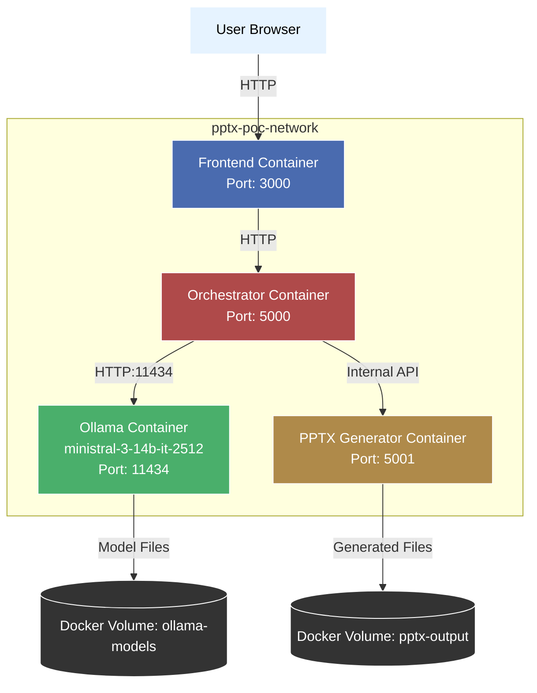
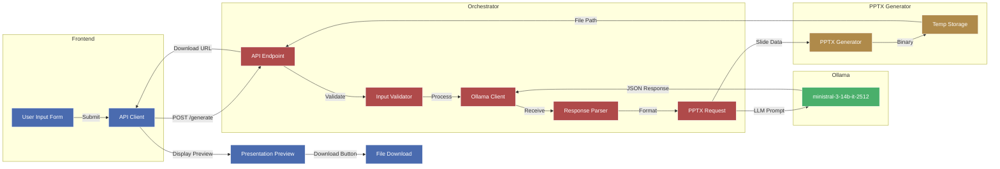
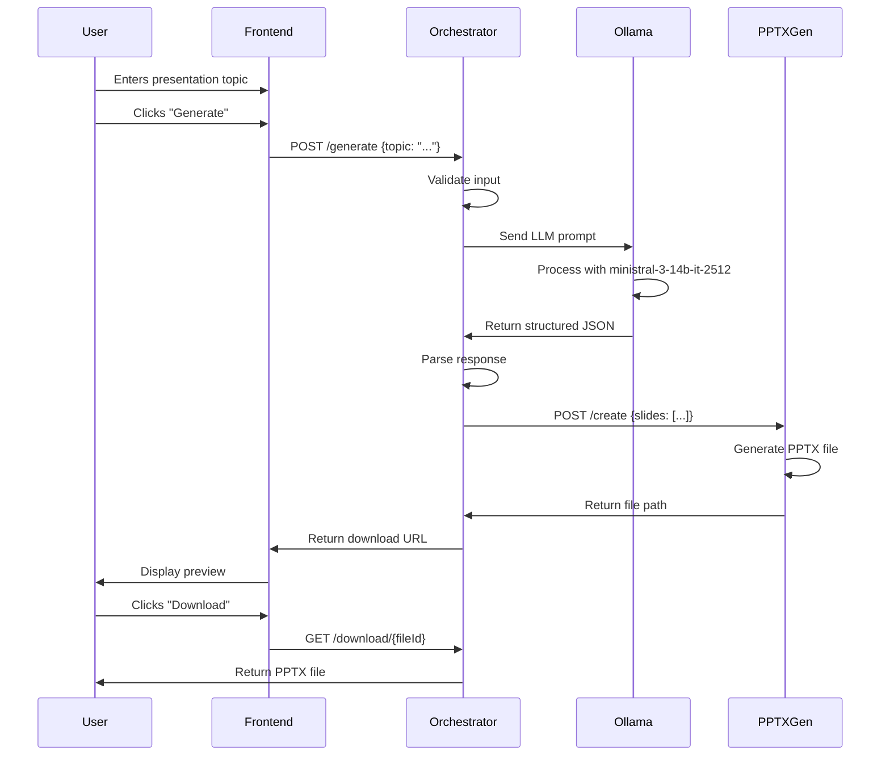
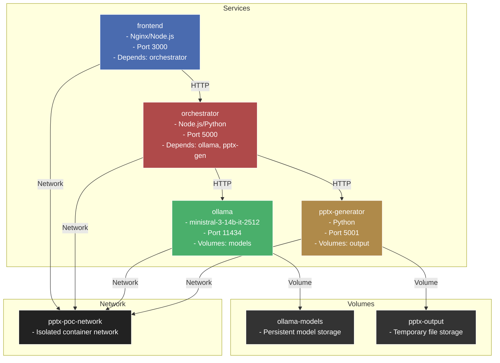
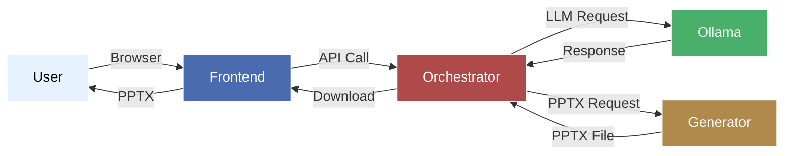

# Architecture Diagrams (Dark Theme Optimized - Fixed)

## System Architecture

## Docker Container Architecture

## Data Flow Diagram

## Component Interaction Sequence

## Docker Compose Service Relationships

## Simple Overview Diagram (Dark Theme)

## Key for Dark Theme Colors
- **Light Blue (#e6f3ff):** User interactions (readable on dark themes)
- **Blue (#4a6baf):** Frontend components
- **Red (#af4a4a):** Orchestrator services
- **Green (#4aaf6b):** AI/Ollama components
- **Orange (#af8a4a):** Generator services
- **Dark (#333/#222):** Storage/volumes/network