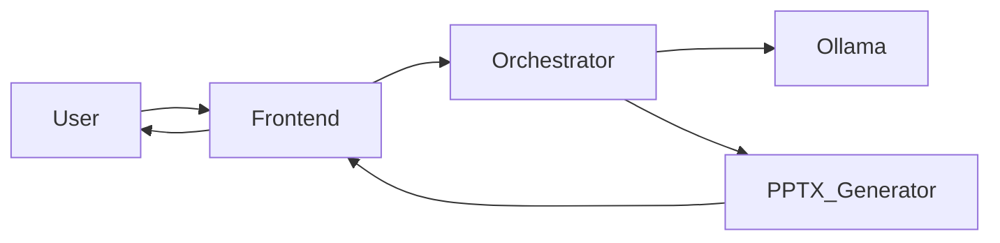

# PowerPoint Generation POC with Local AI

## 📋 Project Overview

**Status:** 🚀 Sprint 1 Implementation In Progress (62%)
**Objective:** Create a minimal viable POC demonstrating that local AI models running in Ollama can generate professional PowerPoint presentations through a simple web interface using natural language input.

## 🎯 Project Goals

✅ **Primary Goal:** Demonstrate feasibility of AI-generated PowerPoint presentations
✅ **KISS Approach:** Keep It Simple, Stupid - focus on core functionality first
✅ **Technical Validation:** Prove the concept works with current AI models
✅ **Docker Microservices:** Establish scalable containerized architecture

## 📚 Project Documentation

This repository contains the complete project plan and architecture for the PowerPoint Generation POC:

### 📖 Core Documentation
- **[PROJECT_PLAN.md](PROJECT_PLAN.md)** - Complete Project Initiation Document (PID) with:
  - Sprint 0: Project goals, requirements, user stories
  - Sprint 1: Detailed implementation plan
  - Technical specifications and execution roadmap
  - Risk assessment and future sprint ideas

### 🔬 Technology Research
- **[TECHNOLOGY_RECOMMENDATIONS.md](TECHNOLOGY_RECOMMENDATIONS.md)** - Research findings and decisions:
  - Evaluated frameworks and libraries for each component
  - Selected technology stack with rationale
  - Example Dockerfiles and code snippets
  - Suggested project structure

### 🎨 Architecture Visualization
- **[architecture_diagrams.md](architecture_diagrams.md)** - Dark theme optimized diagrams with:
  - High-contrast colors for better readability
  - Clear component differentiation
  - Simple overview diagrams
  - Color-coded component types
  - System architecture and component interactions
  - Docker container relationships
  - Data flow and sequence diagrams
  - Service dependencies

## 🚀 Quick Start

**See [QUICK_INSTALL.md](QUICK_INSTALL.md) for full setup instructions.**

```bash
# 1. Clone and configure
git clone <repository-url>
cd pptx_poc
cp .env.example .env

# 2. Setup Ollama (skip if you already have one running)
docker compose -f docker-compose.ollama.yml up -d
docker exec ollama ollama pull ministral-3:14b-instruct-2512-q8_0

# 3. Start the stack
docker compose up -d
```

### Project Structure
```
pptx_poc/
├── docker-compose.yml       # Main stack (connects to external Ollama)
├── docker-compose.ollama.yml # Optional: standalone Ollama for fresh installs
├── .env.example             # Environment template with port/model config
├── QUICK_INSTALL.md         # Setup guide with model recommendations
├── PROJECT_PLAN.md          # Complete project documentation
├── TECHNOLOGY_RECOMMENDATIONS.md # Technology research and decisions
├── architecture_diagrams.md # Visual architecture diagrams
└── Sprint1/                 # Sprint 1 planning documents
```

### Key Technologies
- **AI Backend:** Ollama with ministral-3 models (configurable by VRAM)
- **Containerization:** Docker with external network for Ollama sharing
- **Frontend:** nginx:alpine serving vanilla HTML/CSS/JS (port 5102)
- **Orchestrator:** FastAPI with async Ollama integration (port 5100)
- **PPTX Generation:** python-pptx v1.0.0 (port 5101)

> See [TECHNOLOGY_RECOMMENDATIONS.md](TECHNOLOGY_RECOMMENDATIONS.md) for full rationale and examples.

## 🎯 Sprint 0: Project Initiation (✅ COMPLETE)

### What We've Accomplished
1. **Project Initiation Document** - Structured PID with clear goals
2. **Requirements Analysis** - Functional and non-functional requirements
3. **User Stories & Use Cases** - Clear user journey mapping
4. **Prioritized Backlog** - Focused on MVP delivery
5. **Conceptual Design** - System architecture overview
6. **Technical Design** - Docker microservices blueprint
7. **Execution Plan** - Step-by-step implementation roadmap
8. **Technology Research** - Evaluated and selected frameworks/libraries

### Key Decisions Made
- **AI Model:** ministral-3-14b-it-2512 (current state-of-the-art as of Dec 2025)
- **Architecture:** Docker microservices with 3-4 containers
- **Frontend:** nginx:alpine + vanilla HTML/JS (no framework)
- **Backend:** FastAPI (Python) - async, same language as PPTX generator
- **PPTX:** python-pptx v1.0.0 - stable, well-maintained
- **LangChain:** Skipped for MVP - direct Ollama HTTP calls sufficient
- **Scope:** 3-slide presentations for MVP
- **Approach:** KISS - minimal complexity, maximum validation

## 🏗️ Sprint 1: Implementation Plan

### Phase 1: Core Components (High Priority)
1. **Frontend Development** - nginx:alpine + vanilla HTML/CSS/JS
2. **Orchestrator Service** - FastAPI with async Ollama integration
3. **PPTX Generator** - python-pptx with basic 3-slide template
4. **Docker Implementation** - Containerize all components

### Phase 2: Integration & Testing
1. **End-to-end workflow validation**
2. **Error handling and edge cases**
3. **Performance optimization**
4. **User acceptance testing**

### Expected Deliverables
- ✅ Working web interface for presentation generation
- ✅ Functional API communication with Ollama backend
- ✅ Professional 3-slide PowerPoint output
- ✅ Downloadable PPTX files
- ✅ Dockerized microservices architecture

## 📊 Architecture Highlights

### System Components


### Docker Services
- **Frontend Container** - Web interface (Port 5102)
- **Orchestrator Container** - API service (Port 5100)
- **Ollama Container** - External, shared via `ollama-network` (Port 11434 internal)
- **PPTX Generator Container** - File generation (Port 5101)

## 🔮 Future Roadmap

### Potential Next Steps
- **Sprint 2:** Advanced templates, image integration, 5-10 slide support
- **Sprint 3:** User experience enhancements, editing capabilities
- **Sprint 4:** Collaborative features, multi-language support

## 🤝 Getting Involved

### How to Contribute
1. **Review the [Project Plan](PROJECT_PLAN.md)** - Understand the complete vision
2. **Review [Technology Recommendations](TECHNOLOGY_RECOMMENDATIONS.md)** - Selected stack and rationale
3. **Examine the [Architecture Diagrams](architecture_diagrams.md)** - Visualize the system (dark theme optimized)
4. **Start with Sprint 1 tasks** - Focus on core implementation
5. **Follow Docker best practices** - Maintain containerized approach

### Development Setup

See [QUICK_INSTALL.md](QUICK_INSTALL.md) for detailed setup instructions, including:
- Environment configuration (`.env`)
- Ollama setup (fresh install vs existing)
- Model selection guide by GPU VRAM
- Docker network strategy explanation

## 📞 Contact & Support

For questions about this POC:
- **Project Lead:** [Your Name]
- **Status:** Active development
- **Current Phase:** Sprint 1 Implementation (62% complete)

---

> 💡 **Remember:** This is a POC - focus on proving the concept works before adding complexity!