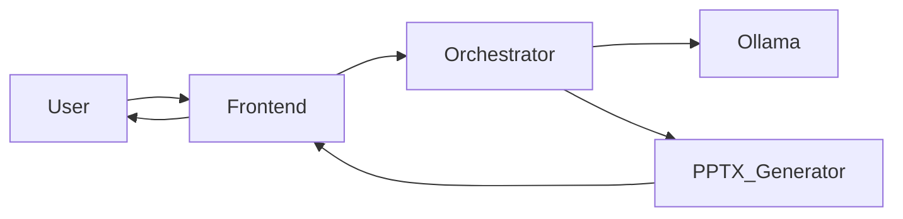

# PowerPoint Generation POC with Local AI

## 📋 Project Overview

**Status:** 🚀 Active Planning Phase (Sprint 0 Complete)
**Objective:** Create a minimal viable POC demonstrating that local AI models running in Ollama can generate professional PowerPoint presentations through a simple web interface using natural language input.

## 🎯 Project Goals

✅ **Primary Goal:** Demonstrate feasibility of AI-generated PowerPoint presentations
✅ **KISS Approach:** Keep It Simple, Stupid - focus on core functionality first
✅ **Technical Validation:** Prove the concept works with current AI models
✅ **Docker Microservices:** Establish scalable containerized architecture

## 📚 Project Documentation

This repository contains the complete project plan and architecture for the PowerPoint Generation POC:

### 📖 Core Documentation
- **[PROJECT_PLAN.md](PROJECT_PLAN.md)** - Complete Project Initiation Document (PID) with:
  - Sprint 0: Project goals, requirements, user stories
  - Sprint 1: Detailed implementation plan
  - Technical specifications and execution roadmap
  - Risk assessment and future sprint ideas

### 🎨 Architecture Visualization
- **[architecture_diagrams.md](architecture_diagrams.md)** - Dark theme optimized diagrams with:
  - High-contrast colors for better readability
  - Clear component differentiation
  - Simple overview diagrams
  - Color-coded component types
  - System architecture and component interactions
  - Docker container relationships
  - Data flow and sequence diagrams
  - Service dependencies

## 🚀 Quick Start Guide

### Project Structure
```
pptx_poc/
├── PROJECT_PLAN.md          # Complete project documentation
├── architecture_diagrams.md # Visual architecture diagrams
├── readme.md                # This file
└── (future implementation files)
```

### Key Technologies
- **AI Backend:** Ollama with **ministral-3-14b-it-2512** (Q8 quantized)
- **Containerization:** Docker with microservices architecture
- **Frontend:** Simple web interface (HTML/CSS/JS)
- **Backend:** Node.js/Python orchestrator service
- **PPTX Generation:** Python-pptx library

## 🎯 Sprint 0: Project Initiation (✅ COMPLETE)

### What We've Accomplished
1. **Project Initiation Document** - Structured PID with clear goals
2. **Requirements Analysis** - Functional and non-functional requirements
3. **User Stories & Use Cases** - Clear user journey mapping
4. **Prioritized Backlog** - Focused on MVP delivery
5. **Conceptual Design** - System architecture overview
6. **Technical Design** - Docker microservices blueprint
7. **Execution Plan** - Step-by-step implementation roadmap

### Key Decisions Made
- **AI Model:** ministral-3-14b-it-2512 (current state-of-the-art as of Dec 2025)
- **Architecture:** Docker microservices with 4 main containers
- **Scope:** 3-slide presentations for MVP
- **Approach:** KISS - minimal complexity, maximum validation

## 🏗️ Sprint 1: Implementation Plan

### Phase 1: Core Components (High Priority)
1. **Frontend Development** - Simple web interface for user input
2. **Orchestrator Service** - API endpoint and Ollama integration
3. **PPTX Generator** - Basic 3-slide template implementation
4. **Docker Implementation** - Containerize all components

### Phase 2: Integration & Testing
1. **End-to-end workflow validation**
2. **Error handling and edge cases**
3. **Performance optimization**
4. **User acceptance testing**

### Expected Deliverables
- ✅ Working web interface for presentation generation
- ✅ Functional API communication with Ollama backend
- ✅ Professional 3-slide PowerPoint output
- ✅ Downloadable PPTX files
- ✅ Dockerized microservices architecture

## 📊 Architecture Highlights

### System Components


### Docker Services
- **Frontend Container** - Web interface (Port 3000)
- **Orchestrator Container** - API service (Port 5000)
- **Ollama Container** - AI model (Port 11434)
- **PPTX Generator Container** - File generation (Port 5001)

## 🔮 Future Roadmap

### Potential Next Steps
- **Sprint 2:** Advanced templates, image integration, 5-10 slide support
- **Sprint 3:** User experience enhancements, editing capabilities
- **Sprint 4:** Collaborative features, multi-language support

## 🤝 Getting Involved

### How to Contribute
1. **Review the [Project Plan](PROJECT_PLAN.md)** - Understand the complete vision including new technology research section
2. **Examine the [Architecture Diagrams](architecture_diagrams_fixed.md)** - Visualize the system (dark theme optimized)
3. **Complete Technology Research** - Evaluate existing Docker solutions before implementation
4. **Start with Sprint 1 tasks** - Focus on core implementation based on research findings
5. **Follow Docker best practices** - Maintain containerized approach

### Development Setup
```bash
# Clone the repository
git clone [repository-url]
cd pptx_poc

# Review documentation
cat PROJECT_PLAN.md
cat architecture_diagrams.md

# Implementation will follow in Sprint 1
```

## 📞 Contact & Support

For questions about this POC:
- **Project Lead:** [Your Name]
- **Status:** Active development
- **Current Phase:** Transitioning from planning to implementation

---

> 💡 **Remember:** This is a POC - focus on proving the concept works before adding complexity!